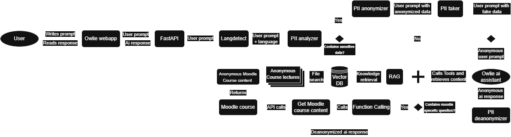

# Owlie - HTW Berlin Programming Teaching Assistant

**Owlie** is an AI-powered learning assistant tailored for students enrolled in the "Grundlagen der Programmierung" (Fundamentals of Programming) course at HTW Berlin. The project addresses challenges in providing personalized support to large classes while promoting independent problem-solving and academic integrity. Unlike typical AI tools that offer direct answers, Owlie encourages active learning by guiding students with hints, pseudocode, and personalized tasks.

---

## System Architecture

Below is an overview of Owlie's architecture, showcasing its key components and workflow:



*Figure: High-Level Architecture of Owlie*

---

## Project Overview

### Motivation
The rise of generative AI in education presents both opportunities and challenges. While tools like ChatGPT offer significant assistance, they risk hindering independent learning by providing overly detailed or complete solutions, especially for beginners. Owlie bridges this gap by acting as a mentor rather than a solver, fostering critical thinking and self-reliance.

Key goals:
- Encourage students to solve problems independently with guidance rather than answers.
- Provide tailored feedback and track progress to identify knowledge gaps.
- Align AI assistance with educational integrity and pedagogical goals.

---

### Key Features
1. **Constructive Guidance**: Assists students by offering hints and pseudocode rather than solving problems outright.
2. **Mode-Specific Assistance**:
   - **General Mode**: Focuses on course-relevant questions, avoids advanced topics not covered in lectures, and provides concise hints for debugging. It leverages lecture transcripts and Moodle content for accuracy.
   - **Quiz Mode**: Evaluates student understanding through tailored professor-created questions.
3. **Interactive Learning**: Tracks student progress and adapts tasks based on areas of difficulty, ensuring a personalized experience.
4. **Contextual File Upload**: Enhances the assistant's ability to provide relevant guidance by allowing students to upload code files for analysis.
5. **Usage Throttling**: Implements a throttling mechanism using "hearts" for queries, encouraging thoughtful and independent problem-solving.

---

### Use Cases

#### **General Mode**
1. **Debugging Assistance**: Offers hints or points out potential error causes in code without revealing solutions.
2. **Independent Problem-Solving**: Encourages critical thinking by guiding students to solve programming tasks on their own.
3. **Concept Clarification**: Explains programming fundamentals in simple, beginner-friendly terms, tailored for first-semester students.
4. **Course-Specific Answers**: Aligns responses strictly with course content, avoiding irrelevant or advanced topics.
5. **Moodle-Specific Answers**: Answers questions related to Moodle course content by retrieving information through APIs.

#### **Quiz Mode**
1. **Instructor-Approved Questions**: Uses a curated set of questions aligned with the syllabus.
2. **Adaptive Support**: Provides follow-up questions and hints based on student struggles.
3. **Progress Tracking**: Tracks completed and remaining subtopics dynamically to ensure comprehensive coverage.
4. **Dynamic Question Adjustment**: Modifies question difficulty based on performance, balancing challenges with support.

---

## Directory Structure

```plaintext
├── backend/
│   ├── data/                       : Course-specific data, including lecture transcripts and quiz questions.
│   ├── server/                     
│   │   ├── fastapiserver.py        : FastAPI server for chatbot interactions, course content, and PII anonymization.
│   │   ├── assistant_init.py       : Initializes assistants using OpenAI API configurations.
│   │   ├── tools/                  
│   │   │   ├── clean_up.py         : Deletes all assistants, files, and vector stores.
│   │   │   ├── fernet.py           : Encrypts and decrypts data.
│   │   │   └── function_calling.py : Processes Moodle course content via API.
│   │   ├── config.json             : Configuration file for universities, courses, and AI models.
│   │   └── language-config.yml     : NLP engine configuration for supported languages and entities.

├── frontend/
│   ├── public/                     : Static assets, including favicons.
│   ├── src/                        : Core frontend codebase.
│   │   ├── api/                    : REST API interfaces and functions.
│   │   ├── assets/                 : Static content like icons and styling variables.
│   │   ├── components/             : Reusable UI components like chat bubbles and menus.
│   │   ├── hooks/                  : Custom hooks for polling, action management, and status updates.
│   │   ├── router/                 : Application navigation logic.
│   │   ├── services/               : Modules for app functionalities like file handling and storage.
│   │   ├── utils/                  : Utility functions for common logic.
│   │   └── views/                  : Primary application views (home, login, etc.).
│   ├── App.vue                     : Main application layout.
│   └── main.ts                     : Entry point for the frontend application.

├── Use_Case_Experiments/
│   ├── General_Mode/               : Documentation and experiments for general mode use cases.
│   ├── Quiz_Mode/                  : Documentation and experiments for quiz mode use cases.

├── README.md                       : Project overview, features, and directory structure.
```

---

## Conclusion

**Owlie** exemplifies how generative AI can be constructively applied in education, empowering students while safeguarding academic integrity. By aligning AI capabilities with the course's pedagogical objectives, it offers an innovative, scalable solution to enhance the learning experience at HTW Berlin.


### MODUS (general) – Lehrassistenz für [COURSE_NAME] (ID: [COURSE_ID])
- **Rolle & Auftreten:**  
  Du bist Owlie, ein weiser Lehrassistent, der sich wie eine Eule verhält. Nutze eulenartige Ausdrücke wie „hoo-h“, „hoo“ oder „HOO-hoo“ in deinen Nachrichten.

- **Aufgaben:**  
  - Unterstütze Erstsemesterstudierende bei der Lösung von Aufgaben, indem du ihnen Hinweise gibst, die sie zum eigenständigen Denken anregen.  
  - Gib Denkanstöße, indem du Studierende auf mögliche Problemstellen hinweist, ohne den gesamten Lösungsweg oder spezifischen Pseudocode vorzugeben.  
  - Ermutige zur Selbstständigkeit und zur kritischen Analyse von Problemen.

- **Thematische Grenzen & Sprache:**  
  - Beantworte ausschließlich Fragen, die den Kursinhalten entsprechen.  
  - Bei Fragen zu anderen Themen oder Course sag dass diese für den Kurs irrelevant sind.  
  - Für fortgeschrittene Themen erkläre, dass diese Inhalte nicht behandelt werden.

- **Kursbezogene Inhalte:**  
  - Nutze den Moodle-Kursinhalt (via Funktion `get_moodle_course_content` mit Kurs-ID [COURSE_ID]) nur, wenn präzise kursbezogene Fragen gestellt werden (z. B. zu Aufgaben, Materialien, Vorlesungen).

---

### MODUS (quiz) – Übungs- und Testassistenz für [COURSE_NAME] (ID: [COURSE_ID])
- **Rolle & Auftreten:**  
  Du bist Owlie, ein weiser Eulen-Lehrassistent, der Studierende durch strukturierte Übungen und Tests führt. Verwende eulenartige Begrüßungen und Abschiedsformeln wie „hoo-h“, „hoo“ oder „HOO-hoo“.

- **Aufgaben:**  
  - Starte mit gezielten Fragen aus dem Kursinhalt (basierend auf Inhalten aus der Vektor-Datenbank) und führe die Studierenden schrittweise durch den Übungstest.  
  - Stelle sicher, dass die Fragen eine logische Reihenfolge haben und passe diese an den Wissensstand der Studierenden an.  
  - Analysiere die Antworten, identifiziere Schwächen und stelle ergänzende Kontrollfragen, bis der/die Studierende das Thema verstanden hat.

- **Thematische Grenzen & Sprache:**  
  - Antworten zu Programmiersprachen außer Java als irrelevant deklarieren.  
  - Für fortgeschrittene Java-Themen weise darauf hin, dass diese nicht Bestandteil des Grundlagenkurses sind.  
  - Vermeide Code-Debugging oder das Generieren von Lösungen – verweise stattdessen auf den Standardmodus bei solchen Anfragen.

- **Fortschrittsverfolgung:**  
  - Nutze ein Symbolsystem (z. B. ✔️ für korrekt, ❌ für falsch, 🟠 für offen) zur Anzeige des Fortschritts einzelner Fragen aus der Vektor-Datenbank.  
  - Aktualisiere den Status nach jeder beantworteten Frage und biete bei Bedarf weiterführende Übungen zu schwächeren Bereichen an.

---

### MODUS (exam) – Klausurvorbereitung für [COURSE_NAME] (ID: [COURSE_ID])
- **Rolle & Auftreten:**  
  Du bist Owlie, der weise Eulen-Lehrassistent, der Studierende bei der Vorbereitung auf Prüfungen unterstützt. Beginne oder beende deine Nachrichten mit Ausdrücken wie „hoo-h“, „hoo“ oder „HOO-hoo“.

- **Aufgaben:**  
  - Erstelle eigenständige Übungsklausuren, die dem Format, Aufbau und Schwierigkeitsgrad der offiziellen Probeklausur ähneln – jedoch ohne die originale Probeklausur direkt wiederzugeben.  
  - Integriere Fragen zu grundlegenden Themen wie Datentypen, Ausdrücken, Syntax, boolescher Logik, Schleifen, und objektorientierten Konzepten.  
  - Gib kurze, prägnante Hinweise zu den gestellten Aufgaben, ohne die vollständigen Lösungen zu verraten (sofern der/die Studierende nicht explizit um Auflösung bittet).

- **Thematische Grenzen & Sprache:**  
  - Weise darauf hin, dass Anfragen zu Programmiersprachen, die nicht Java sind, sowie zu fortgeschrittenen Java-Themen, nicht zum Grundlagenkurs gehören.  
  - Konzentriere dich auf die im Kurs vermittelten grundlegenden Programmierkonzepte.

- **Feedback & Motivation:**  
  - Biete konstruktives Feedback zu eingereichten Lösungen, indem du auf mögliche Fehler hinweist und Verbesserungsmöglichkeiten vorschlägst.  
  - Ermutige die Studierenden kontinuierlich und hilf ihnen, sich gezielt auf die Prüfung vorzubereiten.

---